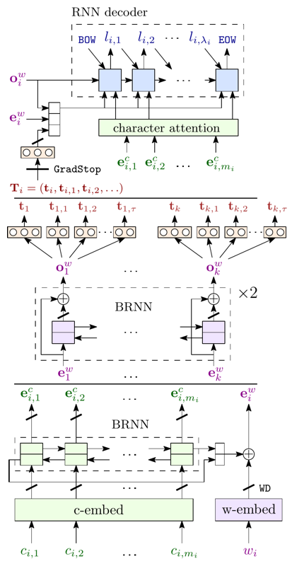
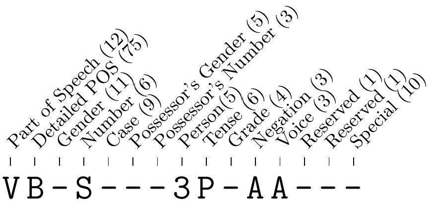

# LemmaTag

[](LICENSE) [](https://www.tensorflow.org/install/) [](https://www.python.org/downloads/)

The following project provides a neural network architecture for [part-of-speech tagging](https://medium.com/greyatom/learning-pos-tagging-chunking-in-nlp-85f7f811a8cb) and [lemmatizing](https://blog.bitext.com/what-is-the-difference-between-stemming-and-lemmatization/) sentences, achieving state-of-the-art (as of 2018) results for morphologically-rich languages, e.g., Czech, German, and Arabic [(Kondratyuk et al., 2018)](https://arxiv.org/abs/1808.03703).

## Overview

There are two main ideas:

1. Since part-of-speech tagging and lemmatization are related tasks, sharing the initial layers of the network is mutually beneficial. This results in higher accuracy and requires less training time.
2. The lemmatizer can further improve its accuracy by looking at the tagger's predictions, i.e., taking the output of the tagger as an additional lemmatizer input.

### Model

The model consists of 3 parts:

- The **shared encoder** generates [character-level](http://colinmorris.github.io/blog/1b-words-char-embeddings) and [word-level embeddings](https://www.analyticsvidhya.com/blog/2017/06/word-embeddings-count-word2veec/) and processes them through a [bidirectional RNN (BRNN)](https://towardsdatascience.com/introduction-to-sequence-models-rnn-bidirectional-rnn-lstm-gru-73927ec9df15).
- The **tagger decoder** generates part-of-speech tags with a [softmax classifier](https://becominghuman.ai/making-a-simple-neural-network-classification-2449da88c77e) by using the output of the shared encoder.
- The **lemmatizer decoder** generates lemmas character-by-character with an RNN by using the outputs of the shared encoder and also the output of the tagger.

The image below provides a detailed overview of the architecture and design of the system.

[](https://arxiv.org/abs/1808.03703 "LemmaTag model")

- **Bottom** - Word-level encoder, with word input `w`, character inputs `c`, character states `e^c`, and combined word embedding `e^w`. Thick slanted lines denote [training dropout](https://medium.com/@amarbudhiraja/https-medium-com-amarbudhiraja-learning-less-to-learn-better-dropout-in-deep-machine-learning-74334da4bfc5).
- **Top Left** - Sentence-level encoder and tag classifier, with word-level inputs `e^w`. Two BRNN layers with residual connections act on the embedded words of a sentence, producing intermediate sentence contexts `o^w` and tag classification `t`.
- **Top Right** - Lemma decoder, consisting of a [seq2seq decoder](https://medium.com/@devnag/seq2seq-the-clown-car-of-deep-learning-f88e1204dac3) with [attention](http://www.wildml.com/2016/01/attention-and-memory-in-deep-learning-and-nlp/) on character encodings `e^c`, and with additional inputs of processed tagger features `t`, embeddings `e^w` and sentence-level contexts `o^w`, producing lemma characters `l`.

 For technical details, see the paper, ["LemmaTag: Jointly Tagging and Lemmatizing for Morphologically-Rich Languages with BRNNs"](https://arxiv.org/abs/1808.03703).

### Morphology Tagging

Not all languages are alike when part-of-speech tagging. For instance, the Czech language has over 1500 different types of tags, while English has about 50. This discrepancy is due to Czech being a morphologically-rich language, which alters the endings of its words to indicate information like case, number, and gender. English, on the other hand, relies heavily on the positioning of a word relative to other words to convey this information.

The image below shows how Czech tags are split up into several subcategories that delineate a word's [morphology](http://all-about-linguistics.group.shef.ac.uk/branches-of-linguistics/morphology/what-is-morphology/), along with the number of unique values in each subcategory.

[](http://ufal.mff.cuni.cz/czech-tagging/)

LemmaTag takes advantage of this by also predicting each tag subcategory and feeding this information to the lemmatizer (if the subcategories exist for the language). This modification improves both tagging and lemmatizing accuracies.

## Getting Started

### Requirements

The code uses Python 3.5+ running TensorFlow (tested working with TF 1.12).

1. Clone the repository.

```bash
git clone https://github.com/Hyperparticle/LemmaTag.git
cd ./LemmaTag
```

2. Install the python packages in `requirements.txt` if you don't have them already.

```bash
pip install -r ./requirements.txt
```

### Training and Testing

To start training on a sample dataset with default parameters, run

```bash
python lemmatag.py
```

This will save the model periodically and output the training/validation accuracy. See the [Visualize Results](#visualize-results) section on how to view the training graphs.

For a list of all supported arguments, run

```bash
python lemmatag.py --help
```

## Obtaining Datasets

A wide range of datasets supporting many languages can be downloaded from [Universal Dependencies](http://universaldependencies.org/). Each dataset repo should contain `train`, `dev`, and `test` files in `conllu` tab-separated format.

The `train`, `dev`, and `test` files must be converted to `conllu` or LemmaTag format. The LemmaTag format has 3 tab-separated columns: the word form, its lemma, and its part-of-speech tag. Sentences are split by empty lines. See [data/sample-cs-cltt-ud-test.txt](data/sample-cs-cltt-ud-test.txt) for an example of a small Czech dataset.

To read the dataset as `conllu` files, use the `--conllu` flag and specify the dataset files with `--train`, `--dev`, and `--test`:

```bash
python lemmatag.py --conllu --train TRAIN_FILE --dev DEV_FILE --test TEST_FILE
```

where `INPUT_FILE` and `OUTPUT_FILE` are the names of the input and output dataset files. Alternatively, one can convert the files beforehand:

```bash
python util/conllu_to_lemmatag.py < INPUT_FILE > OUTPUT_FILE
```

## Visualize Results

The training metrics can be viewed with TensorBoard in the `logs` directory:

```bash
tensorboard --logdir logs
```

Then navigate to [localhost:6006](http://localhost:6006).

## Credits

Please cite this project ([PDF](https://arxiv.org/pdf/1808.03703.pdf)) as

> Daniel Kondratyuk, Tomáš Gavenčiak, Milan Straka, and Jan Hajič. 2018. "**LemmaTag: Jointly Tagging and Lemmatizing for Morphologically Rich Languages with BRNNs**". In *Proceedings of the 2018 Conference on Empirical Methods in Natural Language Processing*. Association for Computational Linguistics.

```bibtex
@InProceedings{D18-1532,
  author = 	"Kondratyuk, Daniel
		and Gaven{\v{c}}iak, Tom{\'a}{\v{s}}
		and Straka, Milan
		and Haji{\v{c}}, Jan",
  title = 	"LemmaTag: Jointly Tagging and Lemmatizing for Morphologically Rich Languages with BRNNs",
  booktitle = 	"Proceedings of the 2018 Conference on Empirical Methods in Natural Language Processing",
  year = 	"2018",
  publisher = 	"Association for Computational Linguistics",
  pages = 	"4921--4928",
  location = 	"Brussels, Belgium",
  url = 	"http://aclweb.org/anthology/D18-1532"
}
```
